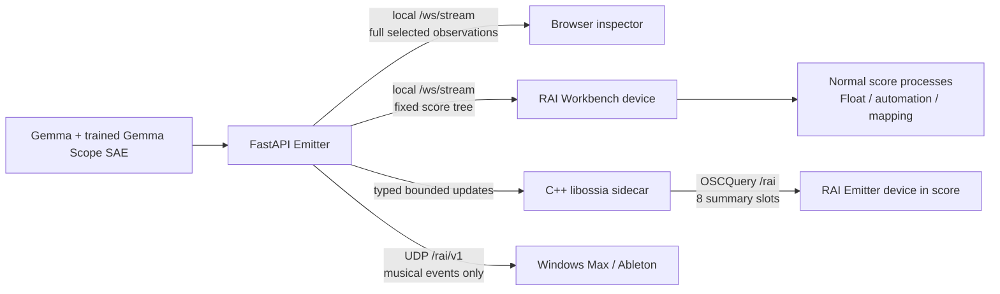

# ossia score and libossia Integration

## Current verified setup

- **Execution machine:** Ubuntu GPU PC.
- **Emitter and inference owner:** FastAPI, PyTorch, Gemma, and Gemma Scope in
  `app/server/`.
- **Local research clients:** the browser and the saved ossia score workbench.
- **Optional bounded connector:** the C++ libossia OSCQuery sidecar named
  `RAI Emitter`.
- **Separate performance connector:** `/rai/v1` UDP OSC to the Windows
  Max/Ableton receiver.

The browser, score workbench, and libossia device are complementary views of
one Emitter. They are not three inference implementations.



## The two score devices

### `RAI Workbench`: exact local research and patching

The saved document `ossia/rai_workbench/rai-workbench.score` contains a
WebSocket device connected to `ws://127.0.0.1:8080/ws/stream`. The custom score
interface uses it for run control, exact token history, dense/SAE provenance,
bounded probe summaries, and four deliberately selected patchable scalars.

For example:

```text
RAI Workbench:/patchable/tensor_rms/value
```

is copied unchanged from the current backend probe's `summary.rms`. Its sibling
fields preserve model, token, site, layer, module path, shape, dtype, and
representation. The built-in Float process
`EXAMPLE_patchable_tensor_rms_delete_safe` only proves ordinary score patching;
it can be removed without removing the observation.

Use the browser or score as the active generation controller, not both at once,
because the backend intentionally owns one live session.

### `RAI Emitter`: optional discoverable summaries

When **Connect → Publish to ossia / OSCQuery** is enabled, the backend starts
`build/ossia-probe-server/rai-ossia-probe-server`. The Python bridge sends
typed, line-safe scalar and provenance updates to the process; official
libossia publishes the stable, read-only `/rai` OSCQuery tree. Defaults are OSC
UDP `9010` and OSCQuery TCP/WebSocket `5678`.

In score 3.8.2:

1. Open Device Explorer (`Ctrl+Shift+D` on Linux if it is hidden).
2. Right-click in Device Explorer and choose **Add device**.
3. Select **OSCQuery**.
4. Choose the discovered **RAI Emitter**, or connect directly to
   `ws://127.0.0.1:5678` when discovery is unavailable.
5. Expand `/rai/probes/1..8` and drag a useful scalar such as `rms` or
   `top_activation` into a normal score process.

This follows score's official
[OSCQuery device workflow](https://ossia.io/score-docs/devices/oscquery-device.html).
The same connection is available to score QML as
`Score.connectOSCQueryDevice(name, url)` and is covered by an installed-score
test in this repository.

The OSCQuery tree contains only selected bounded summaries. Full dense vectors
and complete sparse SAE data stay on the local Emitter WebSocket. Adding the
OSCQuery device is optional and does not make the browser or `RAI Workbench`
function.

## Launch and verification

Start the Emitter:

```bash
./scripts/start.sh --no-browser
```

Open the normal score interface:

```bash
ossia-score --ui \
  ossia/rai_workbench/interface.qml \
  ossia/rai_workbench/rai-workbench.score
```

Use `--ui-debug` instead of `--ui` when the normal patch and Device Explorer
must remain visible.

Reproduce the deterministic patching screenshot:

```bash
UV_CACHE_DIR=/tmp/rai-uv-cache uv run python \
  ossia/rai_workbench/tests/capture_interface.py
```

Verify installed score as a live OSCQuery client of the C++ libossia sidecar:

```bash
UV_CACHE_DIR=/tmp/rai-uv-cache uv run python \
  ossia/rai_workbench/tests/run_oscquery_client_smoke.py
```

The generated acceptance images are intentionally untracked:

- `runs/browser-gemma-270m-probes-live.png`: real RTX 4060 Ti 270M run with
  matching layer-17 dense and trained SAE observations in the probe rack;
- `runs/browser-libossia-live.png`: the same real run with the active OSCQuery
  connection shown. The automated capture used temporary collision-free ports
  `9020`/`5688`; normal defaults remain `9010`/`5678`;
- `runs/ossia-score-slice4.png`: deterministic score view of the four unchanged
  patchable scalars and the removable Float example.

## Does anything else need to be added?

No additional implementation is required for the current local workflow. A
researcher can already move real probes, use the separately trained all-layer
SAEs, patch selected unchanged scalars in score, or discover bounded summaries
through libossia.

Only add another transported metric after a concrete score process needs it.
Do not automatically mirror raw vectors, complete sparse sets, dense coordinate
semantics, or SAE-index semantics into OSCQuery. The remaining Windows task is
an audible/meter validation inside Ableton; it is not missing Ubuntu score or
libossia glue.
